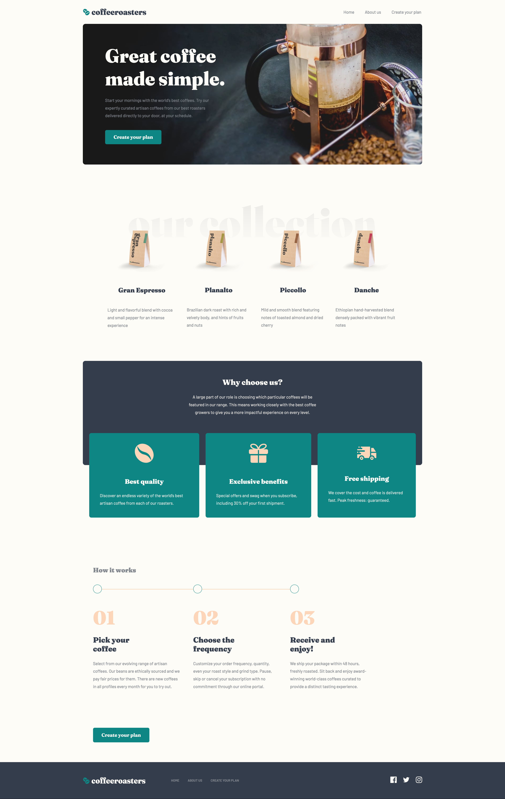

<a name="readme-top"></a>

# Frontend Mentor - Coffeeroasters subscription site

## Table of contents

- [Overview](#overview)
  - [The challenge](#the-challenge)
  - [Built with](#built-with)
  - [Screenshot](#screenshot)
- [My process](#my-process)
  - [What I learned](#what-i-learned)
  - [Useful resources](#useful-resources)

## Overview

The user should be able to:

- View the optimal layout for each page depending on their device's screen size
- See hover states for all interactive elements throughout the site
- Make selections to create a coffee subscription and see an order summary modal of their choices (details provided below)

### The challenge

The interactive subscription page has a number of specific behaviours, which are listed below:

- If "Capsule" is selected for the first option
  - The "Want us to grind them?" section should be disabled and not able to be opened
- Order summary texts updates
  - If "Capsule" is selected, update the order summary text to:
    - "I drink my coffee **using** Capsules"
    - Remove the grind selection text
  - If "Filter" or "Espresso" are selected, update the order summary text to:
    - "I drink my coffee **as** Filter||Espresso"
    - Keep/Add the grind selection text
  - For all other selections, add the selection title in the blank space where appropriate
- Updating per shipment price (shown in "How often should we deliver?" section at the bottom) based on weight selected
  - If 250g weight is selected
    - Every Week price per shipment is $7.20
    - Every 2 Weeks price per shipment is $9.60
    - Every Month price per shipment is $12.00
  - If 500g weight is selected
    - Every Week price per shipment is $13.00
    - Every 2 Weeks price per shipment is $17.50
    - Every Month price per shipment is $22.00
  - If 1000g weight is selected
    - Every Week price per shipment is $22.00
    - Every 2 Weeks price per shipment is $32.00
    - Every Month price per shipment is $42.00
- Calculating per month cost for the Order Summary modal
  - If Every Week is selected, the Order Summary modal should show the per shipment price multiplied by 4. For example, if 250g weight is selected, the price would be $28.80/month
  - If Every 2 Weeks is selected, the Order Summary modal should show the per shipment price multiplied by 2. For example, if 250g weight is selected, the price would be $19.20/month
  - If Every Month is selected, the Order Summary modal should show the per shipment price multiplied by 1. For example, if 250g weight is selected, the price would be $12.00/month

<p align="right">(<a href="#readme-top">back to top</a>)</p>

### Built with

 &nbsp;&nbsp;
 &nbsp;&nbsp;
 &nbsp;&nbsp;


<br>

### Screenshot

<br>



<br>
<br>

## My process

### What I learned

<br>

**_1. Responsive Images: Changing images based on the screen size with HTML._**

Why would we want to do that? In case we want to display a different image on mobile screens and another on desktops.

Example:

```html
<picture>
  <source
    media="(max-width: 499px)"
    srcset="public/assets/home/mobile/image-hero-coffeepress.jpg"
  />
  <source
    media="(max-width: 999px)"
    srcset="public/assets/home/tablet/image-hero-coffeepress.jpg"
  />
  <source
    media="(min-width: 1000px)"
    srcset="public/assets/home/desktop/image-hero-coffeepress.jpg"
  />
  
</picture>
```

<br>

**_2. Lazy Loading Images: Downloading the images only if necessary & Intersection Observer API_**

Why? By default the browser will download all the images at once. To boost the performance of the website we can tell the browser to download the images only when needed. We can don that we the help of the **Intersetion Observer API**.

Example:

```html

```

```js
const imgsToLoad = document.querySelectorAll('img[data-src]');

const loadImg = (entries, observer) => {
  entries.forEach((entry) => {
    if (!entry.isIntersecting) return;

    //Replace src with data-src
    entry.target.src = entry.target.dataset.src;
    //Show img after loaded
    entry.target.addEventListener('load', function () {
      entry.target.classList.remove('lazy-img');
    });

    observer.unobserve(entry.target);
  });
};

const imgObs = new IntersectionObserver(loadImg, {
  root: null,
  threshold: 0,
  rootMargin: '100px',
});

imgsToLoad.forEach((img) => imgObs.observe(img));
```

In this example, we are setting the src attribute of the  to a tiny image, which will download as soon as the user visits the page. Then the original image will download only when the user scrolls down the respective section.

<p align="right">(<a href="#readme-top">back to top</a>)</p>

<br>
<br>

### Useful resources

<br>

- [Responsive Images MDN](https://developer.mozilla.org/en-US/docs/Learn/HTML/Multimedia_and_embedding/Responsive_images) - I found the MDN Documentation to be incredibly helpful as well, when it came to understanding responsive images. It provides a comprehensive and detailed explanation of everything you need to know about implementing responsive images <br>
- [Lazy Loading Article](https://dev.to/pfacklam/native-lazy-loading-of-images-with-zero-javascript-3hnf) - This article explains some of the approaches you can use on your website to apply lazy loading images and how you can do it to support older or modern browsers, depending on your needs. <br>
- [Intersection Observer Kevin Powell](https://www.youtube.com/watch?v=T8EYosX4NOo&t=3s) - If you are more visual when learning, watch this video from Kevin Powell on youtube. He explains everything you need to know about the Intersection Observer API.<br>
- [Intersection Observer MDN](https://developer.mozilla.org/en-US/docs/Web/API/Intersection_Observer_API) - If you want to dive deeper and learn how the Intersection Observer API works under the hood then you just need to read the MDN document.<br>

<p align="right">(<a href="#readme-top">back to top</a>)</p>
